# 数据源架构图（V3.8.0 全量 · 更新版）

> 覆盖：a-stock-data **V3.8.0**（22 源 · 60 能力入口 · 12 层）+ Tushare Pro + westock-data + 问财三件套 + FTShare 系 + 新浪板块资金流 + adata
> 标注：🔴=失效 / 🟡=部分可用 / ✅=正常
> 更新记录（2026-09-01）：升级 V3.7.1——V3.7.0 新增**宏观层 + 筹码分布 + 复权因子 + 估值历史**（baostock/申万/人民银行/国家统计局 4 源 7 端点）；V3.7.1 修复 `get_prefix()` 后缀路由（`000016.SH` 静默错票）；2026-08-09 接入 FTShare 系（远程 MCP + skills，仅交叉验证）
> 更新记录（2026-09-06）：升级 V3.8.0——新增**指数层 L12**（中证/国证成分与权重、中证 PE/股息率）+ 深交所整月交易日历 + 沪深官方两融备胎 + 北交所官方行情备胎；11→12 层、54→60 入口、19→22 源（新增中证指数/国证指数/北交所官方）；国证港股五位代码直接拒绝（防 `00700` 补零错票）

## 一、总体架构（Mermaid）

```mermaid
flowchart TB
    subgraph APP[应用层]
        AG[AI Agent<br/>记忆·技能·门禁]
        SK[技能层<br/>a-stock-data V3.8.0 / tushare-pro /<br/>westock-data / 问财三件套 / Superpowers]
        SCR[项目脚本 scripts/]
    end

    subgraph NET[网络层]
        PROXY[WSL → clash verge 7897<br/>GitHub 走代理 · 国内数据源直连<br/>~/.wsl-clash-proxy.sh 动态网关]
    end

    subgraph BUS[数据层（项目内）]
        API[market_api 数据总线 api]
        GATE[data_gate 守门员<br/>字段级验证·跨源交叉·审计轨迹]
        TS[tushare_pro_data 38 函数]
        TOOLS[工具层<br/>intraday_snapshot / daily_report / sector_cross_check /<br/>em_financial / state_team_scan / fund_portfolio / verify_v360]
    end

    subgraph SOURCES[外部数据源]
        subgraph ASTOCK[a-stock-data V3.8.0 · 22 源]
            TDX[通达信 mootdx TCP 7709]
            TX[腾讯财经 ✅]
            BD[百度股市通]
            EM[东财 push2/datacenter/reportapi ✅<br/>push2delay 回退兜底]
            THS[同花顺 THS ✅]
            SINA[新浪财经 ✅]
            CNINFO[巨潮 cninfo]
            CLS[财联社]
            IWENCAI[问财 iwencai]
            SSE[上交所官方]
            SZSE[深交所官方]
            HKEX[港交所 HKEX ✅]
            BS[baostock ✅ V3.7]
            SW[申万研究 ✅ V3.7]
            PBOC[人民银行 ✅ V3.7]
            NBS[国家统计局 ✅ V3.7]
            CSI[中证指数 ✅ V3.8]
            CNI[国证指数 ✅ V3.8]
            BSE[北交所官方 ✅ V3.8 备胎]
        end
        TSPRO[Tushare Pro ✅]
        WST[westock-data ✅]
        WENC[问财 hithink 三件套 ✅]
        FTS[FTShare 系 ✅ 仅交叉验证<br/>MCP 199 工具 + skills 153 子技能]
        SINABJ[新浪板块资金流 ✅]
        ADATA[adata 2.9.5 ✅]
    end

    AG --> SK
    SCR --> API
    SCR --> TS
    API --> GATE
    SCR --> TOOLS

    API --> TX
    API --> TDX
    API --> EM
    API --> THS
    API --> SINA
    API --> HKEX
    TS --> TSPRO
    API -.westock helper.-> WST
    SK --> WENC
    SK -.交叉验证.-> FTS
    SCR -.资金流/概念当日.-> SINABJ
    TOOLS -.个股归属/概念.-> ADATA
    SK --> BS
    SK --> SW
    SK --> PBOC
    SK --> NBS

    SCR -.GitHub/境外.-> PROXY
    API -.国内数据源直连（trust_env=False）.-> SOURCES

    GATE --> RPT[reports/ 报告体系]
    TOOLS --> RPT
```



## 二、数据源清单

### a-stock-data V3.10.0 主源体系（34 源 · 87 能力入口 · 15 层 · 2026-09-24 升级）

> ⚠️ **V3.9/3.10 重大变化（2026-09-22 上游发布）**：通达信 mootdx 公开服务器的 K线/五档/逐笔命令 2026-09 起返回空（issue #52 实测 10 台均 0 行）——mootdx **降级为仅财务快照/F10**，行情主源改为腾讯三域名轮换，逐笔改用腾讯 `tencent_ticks()`。

| 优先级 | 数据源 | 状态 | 提供 | 封IP风险 |
|---|---|---|---|---|
| 1 | 腾讯财经（三域名轮换）| ✅ | 实时PE/PB/市值/换手/涨跌停/指数/ETF/分钟K/分段K线/**当日逐笔(tencent_ticks §1.4)**（带 `is_stale` 僵尸报价标志）| 低 |
| 2 | 东财 datacenter | ✅ | 龙虎榜/解禁/融资融券/大宗/股东户数/分红/个股信息 | 低 |
| 3 | 东财 push2/push2his | ✅ | 板块/个股资金流（分钟级+120日）/概念/地域 | 低 |
| 4 | 通达信官网盘后包（§1.3 `tdx_daily_package`）| ✅ | 某交易日沪深北全市场日线含成交额（2022-01 起可用）| 极低 |
| 5 | 百度股市通 | ✅ | 概念板块+K线带MA | 极低（零鉴权）|
| 6 | 新浪财经 | ✅ | 财报三表/复权因子/期权/**期货日K含大商所(§13.7)**/研报列表(V3.9) | 低 |
| 7 | 问财 iwencai | ✅ | NL 语义搜研报/选股（需 Key）| 低 |
| 8 | 东财 reportapi/PDF | ✅ | 研报全文+评级+EPS+PDF 下载 | 低 |
| 9 | 同花顺热点 | ✅ | 当日强势股+题材归因 | 极低（零鉴权）|
| 10 | 同花顺 hsgtApi | ✅ | 北向资金分钟级（hgt 可用 / sgt 仅参考）| 极低（零鉴权）|
| 11 | 同花顺 basic | ✅ | 一致预期 EPS | 低 |
| 12 | 财联社 | ✅ | 全市场实时电报（官方签名零key）| 低 |
| 13 | 华尔街见闻（V3.9）| ✅ | 7×24 快讯 | 极低 |
| 14 | 央视网（V3.9）| ✅ | 新闻联播条目与文字稿 | 极低 |
| 15 | 巨潮 cninfo | ✅ | 公告全文检索+PDF/互动易 | 低 |
| 16 | 上证e互动（V3.9）| ✅ | 沪市问答（补互动易缺口）| 极低 |
| 17 | 上交所官方（备胎）| ✅ | 龙虎榜全文/实时五档/ETF份额（`yunhq.sse.com.cn`）| 极低（零鉴权）|
| 18 | 深交所官方（备胎）| ✅ | 龙虎榜/公告+PDF/实时五档/ETF份额 | 极低（零鉴权）|
| 19 | baostock（V3.7）| ✅ | 估值历史 PE/PB/PS/PCF+换手率+停牌+ST+上市退市日（**不支持北交所**）| 极低（免注册）|
| 20 | 申万研究（V3.7）| ✅ | 行业分类变迁史（公开 XLS，消除前视偏差）| 极低 |
| 21 | 人民银行（V3.7）| ✅ | 社会融资规模增量（月度）| 极低 |
| 22 | 国家统计局（V3.7）| ✅ | PMI 制造业/非制造业/综合+大中小型 | 极低 |
| 23 | 中证指数（V3.8）| ✅ | 指数成分/权重/两种口径 PE 与股息率 | 极低（零鉴权，忌高频重复下载）|
| 24 | 国证指数（V3.8）| ✅ | 最近公布的指数成分/权重（月末快照）| 极低（零鉴权）|
| 25 | 北交所官方（V3.8，备胎）| ✅ | 当前行情/五档/成交量额 | 极低（匿名 Cookie 会话，分页限速）|
| 26 | 五大期货交易所官方（V3.9）| ✅ | 上期所/上期能源/郑商所/中金所/广期所日行情+期权+持仓排名（中金所/广期所仅 HTTP，2026-09-20 实测 TCP 握手异常）| 极低 |
| 27 | 上金所 SGE（V3.9）| ✅ | 现货贵金属（Au/Ag 等）| 极低 |
| 28 | 中债/中国货币网（V3.9）| ✅ | 收益率曲线/回购定盘利率 FR·FDR/LPR 全历史 | 极低 |
| 29 | 富时 A50（V3.9）| ✅ | A50 期货（新浪源）| 极低 |
| 30 | mootdx（TCP，**已降级**）| ⚠️ 仅剩 | 财务快照/F10（K线/五档/逐笔 2026-09 起返回空，issue #52）| 极低 |

**15 层结构**：L1 行情 / L2 研报 / L3 信号 / L4 资金面·筹码 / L5 新闻 / L6 基础数据 / L7 公告 / L8 打板 / L9 ETF期权 / L10 舆情互动 / L11 宏观与利率 / L12 指数 / **L13 期货与大宗商品（V3.9）** / **L14 事件驱动（V3.9：业绩预告/调研/增减持/回购/质押/新股日历）** / **L15 可转债（V3.9）**

### 配套源（9 个）

| # | 数据源 | 状态 | 提供 |
|---|---|---|---|
| 20 | Tushare Pro | ✅ | 指数/个股日线、Alpha因子、停复牌、复权因子、财报三表（`tushare_pro_data.py` 38 函数，token 在 `config/tushare_config.json`）|
| 21 | westock-data | ✅ | 宏观/港美股 ETF/期货外汇/可转债（`npx` 免 key）|
| 22 | 问财 hithink 三件套 | ✅ | NL 选股/财务查询/行情问答（key 在 `config/iwencai_config.json`）|
| 23 | **FTShare-MCP**（远程）| ✅ | 199 工具（194 `ft_*` + 5 便捷入口），`market.ft.tech/gateway/mcp`，免 key 只读，**仅交叉验证、禁作唯一源** |
| 24 | **ftshare-market-data**（skills）| ✅ | 153 子技能，`run.py` 统一调度走 `/api/v1`，免 key 只读，**仅交叉验证** |
| 25 | 新浪板块资金流 | ✅ | 板块资金流全量 + 概念/行业当日涨幅 |
| 26 | adata 2.9.5 | ✅ | 个股四维归属、概念指数、全市场资金流 |
| 27 | push2delay.eastmoney.com | ✅ 保险通道 | 东财延时数据（约 15 分钟），push2 风控时自动接管 |
| 28 | 本地计算 | ✅ | 估值公式/筹码分布推演/数据守门员 |

## 三、V3.7.x 新增能力与已知行为

### V3.7.0 新增端点（2026-08-19 实测）

| § | 端点 | 拿什么 | 源 | ⚠️ 已知坑 |
|---|---|---|---|---|
| 4.6 | `chip_distribution(df)` | 筹码分布（获利比例/平均成本/90-70 成本区间/筹码峰）| 本地推演（东财无公开 CYQ 接口）| 初始筹码播种为首日全部流通盘 |
| 6.5 | `baostock_valuation_history()` | 日频估值历史+换手率+停牌+ST | baostock | 不支持北交所（登录前拦截）|
| 6.6 | `baostock_stock_basic()` | 上市日/**退市日**/状态 | baostock | 唯一退市日期零鉴权源 |
| 6.7 | `sw_industry_history()` | 申万行业**变迁史**（防前视偏差）| 申万 | 官方只发代码无中文名 |
| 11.1 | `pboc_social_financing()` | 社融增量（月度 12 列）| 人民银行 | 未发布月份整行丢弃 |
| 11.2 | `nbs_pmi()` | 制造业/非制造业/综合 PMI | 国家统计局 | 正文全角括号内带空格 |
| 1.4 | `sina_adjust_factor()` | 复权因子 qfq/hfq | 新浪 | 响应尾部挂 `/* base64 */` 注释块 |

### V3.7.1 已知行为（2026-08-20 实测修复）

- 北交所老号段（43/83/87）返回僵尸数据且不报错——一律 `norm_ticker()` 归一化用 920 新码
- `get_prefix()` 已认 `.sh/.sz/.bj` 后缀（`000016.SH ≡ sh000016`）；腾讯/新浪仍只认纯 6 位或前缀式——**拿到用户输入先过 `norm_ticker()`** 总原则不变
- `tencent_quote()` 带 `is_stale` 标志；东财研报遇老码抛 ValueError 而非静默返回空

### V3.8.0 新增能力（2026-09-05 发布 · 2026-09-06 接入）

| 端点 | 拿什么 | 源 | ⚠️ 已知坑 |
|---|---|---|---|
| `index_constituents(index_code, provider="csi")` | 最近公布的沪深北指数成分（保留源侧快照日期）| 中证/国证 | csi 日度文件 / cni 月末文件，`date` 为源侧快照日 |
| `index_weights(index_code, provider="csi")` | 指数权重（百分数，校验合计与重复）| 中证/国证 | `weight_percent=0.433` 是 0.433% 不是 43.3% |
| `index_valuation(index_code)` | 两种股本口径 PE、股息率 | 中证 | **不含 PB、不承诺全历史** |
| `trading_calendar(year, month)` | 官方整月交易日历（逐日 `is_open`）| 深交所 | 不自行猜节假日；未发布月份报错不返回休市 |
| `margin_trading_backup(date, exchange, code=None)` | 沪深官方两融（金额元、余量股/份）| 上交所/深交所 | 须单所分别请求；深所不含两种偿还字段 |
| `bse_quote_backup(date, code=None)` | 北交所全板/单票当前行情+五档 | 北交所 | 只接受北交所纯 6 位代码；须核验交易日 |
| 国证港股防护 | 五位港股代码直接拒绝 | 国证 | 防 `00700` 补零成 `000700/SZ` 静默错票 |

## 四、降级链（关键数据的主→备胎）

| 数据 | 主源 | 备胎1 | 备胎2 | 冷却/恢复 |
|---|---|---|---|---|
| 实时行情+五档 | **腾讯**（mootdx 行情已死 #52）| **上交所 yunhq / 深交所官方**（一手五档）| — | 恒 |
| 指数收盘 | 腾讯 | Tushare（双源交叉 <0.001 点）| — | 恒 |
| K线（全历史）| **腾讯 tencent_kline（三域名轮换）**/百度 | 同花顺 `d.10jqka.com.cn`（日/周/月/30/60分）| 通达信官网盘后包（全市场日线）| 恒 |
| K线（分钟）| **腾讯 `ifzq.gtimg.cn` mkline**（m1-m60，主源）| mootdx（已死留档）| — | 恒 |
| 当日逐笔 | **腾讯 tencent_ticks（§1.4）**（mootdx transaction 已死）| — | — | 仅最近一交易日，北交所/指数报错 |
| 涨停池 | 东财 push2ex 🔴（API 已下线 rc:102）| **同花顺 ths_limit_up_pool** | — | 30 分钟冷却+自动恢复 |
| 板块涨幅 | 腾讯 | **东财（已恢复）** | **新浪/申万** | sector_cross_check 四源 |
| 板块资金流 | 东财 push2 ✅ | **push2delay**（风控回退）| westock TOP3 | 自动 |
| 概念当日 | 新浪 | adata 同花顺 | 东财（已恢复）| — |
| 地域当日 | 东财 push2（间歇）| **涨停地域归因代理**（region_active）| 次日 ths_daily 回填 | region_daily 三源 |
| 龙虎榜 | 东财 datacenter | **沪深交易所官方** `dragon_tiger_backup()`（含席位）| — | 恒 |
| 个股资金流 | 东财 push2 | **新浪日度** `fund_flow_backup()` | — | 恒 |
| 公告 | 巨潮 | **深交所官方/东财** `announcements_backup()`（含PDF）| — | 恒 |
| 财务三表 | 新浪/mootdx | 同花顺 F10（`_debt/_benefit/_cash`）| Tushare | 恒 |
| 财务指标 | 东财 datacenter ✅（非 push2 主机）| **tushare 财务**（交叉验证 <1%）| — | em_financial.py |
| 快讯 | 东财 7×24 | 财联社（互备）| 金十 `flash_newest.js` | 恒 |
| 北向（权威）| 同花顺 hexin | **HKEX 官方**日统计（净买入停披后唯一权威口径）| — | 收盘后 17:00 |
| 估值历史/宏观 | baostock / 央行 / 统计局 | —（均为官方站，无独立备胎）| — | — |

**降级原则**：各备胎为**不同域名、不同风控面**——东财被封时交易所官方/新浪/同花顺/财联社不受牵连。

## 五、数据管线（一次取数的完整路径）

```
脚本调用
  → market_api.api / tushare_pro_data / 工具层 / a-stock-data 技能
    → 网络层（国内数据源直连 · GitHub/境外走 clash 代理）
      → 数据源（22 源 + 配套：腾讯/东财/push2delay/同花顺/新浪/Tushare/
        HKEX/westock/adata/baostock/申万/央行/统计局/中证/国证/北交所/FTShare 交叉验证）
        → data_gate 守门员（字段级校验 + 审计 + 降级链判定）
          → 报告/快照/动画（reports/）
```

## 六、当前状态（2026-09-06）

| 项 | 状态 |
|---|---|
| a-stock-data 版本 | ✅ **V3.8.0**（双份 md5 一致：`~/.grok/skills/` + `a-stock-data-main/`，CI 门禁 2026-09-06 升级）|
| 指数层 L12 | ✅ V3.8.0 新增（中证/国证成分·权重·估值，2026-09-05 上游实测）|
| 官方两融/北交所备胎 | ✅ V3.8.0 新增（沪深单所两融 + 北交所行情快照）|
| 东财 push2（板块/资金流/概念/地域）| ✅ 全部恢复（fid 周期修复 + push2delay 兜底 + `em_get()` 全局限流防封）|
| 地区板块当日 | ✅ 三源方案（push2 真实涨幅间歇 → 涨停地域归因代理 → 次日 ths 回填）|
| 涨停池 | 东财 push2ex 已下线 → 同花顺降级（正常链路）|
| 北向净买入 | 官方停披（2024-08-18）→ 成交额权威口径（HKEX）|
| 宏观层 | ✅ V3.7.0 新增（社融/PMI，零 key 官方站）|
| FTShare 系 | ✅ 2026-08-09 接入，远程公共只读，仅交叉验证 |
| mcp-eastmoney（GitHub 项目）| 已评估——未采用 MCP 中转，直接集成 push2delay 更优 |

## 七、验证体系（多源交叉）

| 验证层 | 工具 |
|---|---|
| 版本保证 | `verify_a_stock_data_v360.py`（门禁：双份版本==3.8.0 + md5 + V3.8.0 API 面 + 无旧接口残留，进 CI）|
| 联网冒烟 | `verify_a_stock_data_v360.py --live`（腾讯行情 + Tushare/westock/问财 三源链路）|
| 板块四源 | `sector_cross_check.py`（腾讯/新浪/申万/东财）|
| 个股四维 | `stock_plates.py`（adata）|
| 概念当日 | `concept_daily()`（新浪）+ `concept_daily_adata()`（adata）|
| 指数双源 | 腾讯 ↔ Tushare（<0.001 点）|
| 打板双源 | 东财 = 同花顺 |
| 资金流双源 | 东财 ↔ 新浪（口径差异已标注）|
| 财务双源 | 东财 datacenter ↔ tushare（`em_financial.py`，>1% 告警）|
| FTShare 交叉 | `mcp__ftshare__*` / `ftshare-market-data`（关键结论 ≥2 源互验，仅补充源）|
| 国家队持仓 | `state_team_scan.py`（tushare top10_holders 两期对比）|
| 基金重仓 | `fund_portfolio.py`（tushare 全市场基金持仓）|

## 八、费用评估（2026-09-01）

| 类别 | 源 | 说明 |
|---|---|---|
| 🆓 免费公开接口 | a-stock-data 22 源（除 iwencai）+ 新浪资金流 + adata + push2delay + westock + FTShare 系 | 无费用；⚠️ 风险=风控封禁/限流/接口变更/延时，靠降级链+多源交叉吸收 |
| 🟡 积分制（1）| Tushare Pro（当前 5000 档）| 免费注册积分制；日常接口已覆盖，Alpha 因子等需更高档 |
| 💰 付费（1）| 问财 iwencai（唯一收费源）| openapi.iwencai.com SkillHub 按量/包月；key 在 `config/iwencai_config.json` |

## 九、已死源清单（🔴 禁止使用）

| 源 | 状态 |
|---|---|
| 网易财经（126.net）| 整站下线 |
| 和讯 / 凤凰行情 | 失效 |
| 腾讯资金流（`ff_` 接口）| 已死 |
| 雪球免登录深度数据 | 需 token |
| 东财 push2ex 涨停池 | API 下线（rc:102）→ 同花顺备胎 |
| sgt 深股通分钟序列 | 北向披露收紧后不可靠（hgt 可用）|

> 备注：mootdx **库**已停更（2024）但通达信 TCP 协议照常——继续用；装不上用 `tdx_client()`。
