# 数据源架构图（2026-08-03 全量 · 更新版）

> 覆盖：a-stock-data V3.6.0（15 源）+ Tushare Pro + westock-data + 问财三件套 + 新浪板块资金流 + adata
> 标注：🔴=失效 / 🟡=部分可用 / ✅=正常
> 更新记录：东财全面恢复（fid 周期修复 + push2delay 回退）、地区缺口解决、adata 轻接入、
> WSL 代理层、东财 datacenter 财务互补源（借鉴 ai-berkshire）、国家队筛选、财务双源交叉

## 一、总体架构（Mermaid）

```mermaid
flowchart TB
    subgraph APP[应用层]
        AG[AI Agent Grok Build<br/>记忆·技能·门禁]
        SK[技能层<br/>a-stock-data V3.6.0 / tushare-pro /<br/>westock-data / 问财三件套 / Superpowers]
        SCR[项目脚本 scripts/]
    end

    subgraph NET[网络层]
        PROXY[WSL → clash verge 7897<br/>GitHub 走代理 · 国内数据源直连<br/>~/.wsl-clash-proxy.sh 动态网关]
    end

    subgraph BUS[数据层（项目内）]
        API[market_api 数据总线 api]
        GATE[data_gate 守门员<br/>字段级验证·跨源交叉·审计轨迹]
        TS[tushare_pro_data 38 函数]
        TOOLS[工具层<br/>intraday_snapshot / daily_report / sector_cross_check /<br/>stock_plates / em_financial / state_team_scan /<br/>fund_portfolio / verify_v360]
    end

    subgraph SOURCES[外部数据源]
        subgraph ASTOCK[a-stock-data V3.6.0 · 15 源]
            TDX[通达信 mootdx TCP 7709]
            TX[腾讯财经 ✅]
            BD[百度股市通]
            EM[东财 push2 ✅<br/>push2delay 回退兜底]
            THS[同花顺 THS ✅]
            SINA[新浪财经 ✅]
            CNINFO[巨潮 cninfo]
            CLS[财联社]
            IWENCAI[问财 iwencai]
            SSE[上交所官方]
            SZSE[深交所官方]
            HKEX[港交所 HKEX ✅]
        end
        TSPRO[Tushare Pro ✅]
        WST[westock-data ✅]
        WENC[问财 hithink 三件套 ✅]
        SINABJ[新浪板块资金流 ✅]
        ADATA[adata 2.9.5 ✅]
    end

    subgraph OUT[产出层]
        RPT[reports/ 报告体系]
        SNAP[盘中快照序列]
        ANIM[资金流水线动画]
        MEM[项目记忆 MEMORY.md]
    end

    AG --> SK
    SCR --> API
    SCR --> TS
    API --> GATE
    SCR --> TOOLS

    API --> TX
    API --> TDX
    API --> EM
    API --> THS
    API --> SINA
    API --> HKEX
    TS --> TSPRO
    API -.westock helper.-> WST
    SK --> WENC
    SCR -.资金流/概念当日.-> SINABJ
    TOOLS -.个股归属/概念.-> ADATA

    SCR -.GitHub/境外.-> PROXY
    API -.国内数据源直连（trust_env=False）.-> SOURCES

    GATE --> RPT
    TOOLS --> RPT
    TOOLS --> SNAP
    SCR --> ANIM
    SCR --> MEM
```



## 二、数据源清单（外部 19 个）

### a-stock-data V3.6.0 主源（15 个，47 端点）

| # | 数据源 | 状态 | 提供 | 优先级 |
|---|---|---|---|---|
| 1 | 通达信 mootdx（TCP）| ✅ | K线/盘口/逐笔/F10 | 1（不封IP）|
| 2 | 腾讯财经 | ✅ | 行情/K线/估值/指数 | 1（不封IP）|
| 3 | 百度股市通 | ✅ | K线带MA | 3 |
| 4 | 东方财富 push2/数据中心 | ✅ **已恢复**（fid 周期修复；push2delay 回退兜底）| 研报/龙虎榜/资金流/打板/概念/地域 | 4（仅独有）|
| 5 | 同花顺 THS | ✅ | 一致预期/涨停池/热点/概念 | 3 |
| 6 | 新浪财经 | ✅ | 财报三表/期权 | 3 |
| 7 | 巨潮 cninfo | ✅ | 公告/互动易 | 3 |
| 8 | 财联社 | ✅ | 电报 | 3 |
| 9 | 问财 iwencai | ✅ | NL 搜研报 | 需Key |
| 10 | 上交所官方 | ✅ | 五档/龙虎榜/公告（备胎）| 备胎 |
| 11 | 深交所官方 | ✅ | 五档/龙虎榜/公告（备胎）| 备胎 |
| 12 | 港交所 HKEX | ✅ | **北向成交额/十大活跃股** | 备胎 |

### 配套源（8 个）

| # | 数据源 | 状态 | 提供 |
|---|---|---|---|
| 13 | Tushare Pro | ✅ | 指数/个股日线、申万行业、同花顺概念/地域指数、Alpha/停复牌 |
| 14 | westock-data | ✅ | 宏观/港美股/申万行业/板块资金流（降级链）|
| 15 | 问财 hithink 三件套 | ✅ | NL 选股/财务查询/行情问答 |
| 16 | 新浪板块资金流 | ✅ | **板块资金流全量 + 概念/行业当日涨幅** |
| 17 | adata 2.9.5 | ✅（东财源已随 push2 恢复）| 个股四维归属、概念指数、全市场资金流 |
| 18 | push2delay.eastmoney.com | ✅ 保险通道 | 东财延时数据（约 15 分钟），push2 风控时自动接管 |
| 19 | **东财 datacenter 财务**（借鉴 ai-berkshire）| ✅ 新接入 | 财务指标（营收/净利/EPS/BPS/ROE/增速），**非 push2 主机不受 WAF** |
| 19 | 本地计算 | ✅ | 估值公式/指标（数据守门员）|

## 三、降级链（关键数据的主→备胎）

| 数据 | 主源 | 备胎1 | 备胎2 | 冷却/恢复 |
|---|---|---|---|---|
| 指数收盘 | 腾讯 | Tushare（双源交叉 <0.001 点）| — | 恒 |
| 涨停池 | 东财 push2ex 🔴（API 已下线 rc:102）| **同花顺 ths_limit_up_pool** | — | 30 分钟冷却+自动恢复 |
| 板块涨幅 | 腾讯 | **东财（已恢复）** | **新浪/申万** | sector_cross_check 四源 |
| 板块资金流 | 东财 push2 ✅ | **push2delay**（风控回退）| westock TOP3 | 自动 |
| 概念当日 | 新浪 | adata 同花顺 | 东财（已恢复）| — |
| 地域当日 | 东财 push2（间歇）| push2delay 🟡（不支持地域返回0）| 次日 ths_daily 回填 | region_daily |
| 个股归属 | adata get_plate_east | — | — | — |
| 北向 | HKEX 官方（净买入停披）| — | — | 收盘后 17:00 |
| 财务指标 | 东财 datacenter ✅（非 push2）| **tushare 财务**（交叉验证 <1%）| — | em_financial.py |
| 热门题材 | 同花顺 | — | — | — |

## 四、数据管线（一次取数的完整路径）

```
脚本调用
  → market_api.api / tushare_pro_data / 工具层
    → 网络层（国内数据源直连 · GitHub/境外走 clash 代理）
      → 数据源（多源：腾讯/东财/push2delay/同花顺/新浪/Tushare/HKEX/westock/adata）
        → data_gate 守门员（字段级校验 + 审计 + 降级链判定）
          → 报告/快照/动画（reports/）
```

## 五、当前状态（2026-08-03 最终）

| 项 | 状态 |
|---|---|
| 东财 push2（板块/资金流/概念/**地域**）| ✅ **全部恢复**（fid 周期修复 + push2delay 兜底）|
| **地区板块当日涨幅** | 🟡 **间歇缺口**（东财地域 m:90+t:1：push2delay 不支持返回 0，push2 直连间歇可达——region_daily 自动探测，否则次日回填）|
| 涨停池 | 东财 push2ex 已下线 → 同花顺降级（正常链路）|
| 北向净买入 | 官方停披（2024-08-18）→ 成交额权威口径（HKEX）|
| 概念当日 | ✅ 三源（新浪主源 + adata + 东财）|
| mcp-eastmoney（GitHub 项目）| 已评估——未采用 MCP 中转，**直接集成 push2delay** 更优（无额外依赖）|

## 六、验证体系（多源交叉）

| 验证层 | 工具 |
|---|---|
| 版本保证 | verify_a_stock_data_v360.py（门禁，进 CI）|
| 板块四源 | sector_cross_check.py（腾讯/新浪/申万/东财）|
| 个股四维 | stock_plates.py（adata）|
| 概念当日 | concept_daily()（新浪）+ concept_daily_adata()（adata）|
| 指数双源 | 腾讯 ↔ Tushare（<0.001 点）|
| 打板双源 | 东财 = 同花顺 |
| 资金流双源 | 东财 ↔ 新浪（口径差异已标注）|
| 财务双源 | 东财 datacenter ↔ tushare（em_financial.py，>1% 告警）|
| 资金全景 | state_team_scan（国家队直接持仓）+ fund_portfolio（机构重仓）|
| 国家队持仓 | state_team_scan.py（tushare top10_holders 两期对比）|
| 基金重仓 | fund_portfolio.py（tushare 全市场基金持仓，机构抱团）|

## 七、费用评估（2026-08-04）

| 类别 | 源 | 说明 |
|---|---|---|
| 🆓 免费公开接口（17）| 通达信/腾讯/百度/东财/push2delay/同花顺/新浪/巨潮/财联社/沪深交易所/HKEX/新浪资金流/adata/westock/东财datacenter | 无费用；⚠️ 风险=风控封禁/限流/接口变更/延时 |
| 🟡 积分制（1）| Tushare Pro（当前 5000 档）| 免费注册积分制；日常接口已覆盖，Alpha因子等需更高档 |
| 💰 付费（1）| 问财 iwencai（唯一收费源）| openapi.iwencai.com SkillHub 按量/包月；key 在 config/iwencai_config.json |

**结论**：20 源 = 17 免费 + 1 积分制（免费档够用）+ 1 付费（问财）。
**应对**：免费源风险靠**降级链 + 多源交叉**吸收（任何源被封都有备胎）；高频量化/逐笔需付费源（当前无此需求）。
